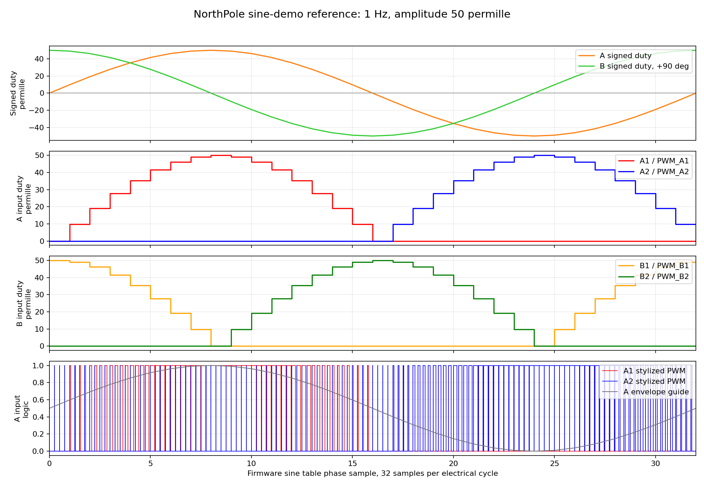

# Motor Sine Reference

- Speed: `1` electrical cycles/s
- Amplitude: `50` permille
- `50` permille means `5%` duty, not `50%` duty.
- Table: 32 samples per electrical cycle
- Firmware step delay: about `31` ms per sample
- A phase means the physical `A` track phase, driven through DRV bridge A.
- B phase means the physical `B` track phase, driven through DRV bridge B.
- A phase sample: `phase`
- B phase sample: `phase + 8`, a 90-degree shift
- Positive sample drives `IN1` PWM and holds `IN2` low.
- Negative sample drives `IN2` PWM and holds `IN1` low.

Important naming clarification:

```text
A/B   = physical propulsion phases on the PCB track
A1/A2 = polarity legs of the A H-bridge, not two separate track phases
B1/B2 = polarity legs of the B H-bridge
```

So actual shuttle motion should use the `AB` firmware target. A1 and A2 are
alternated only to reverse current through the A phase; B1 and B2 do the same
for the B phase.



Scope hookup for the 4-channel check:

```text
CH1 = /PWM_A1, DRV A IN1
CH2 = /PWM_A2, DRV A IN2
CH3 = /PWM_B1, DRV B IN1
CH4 = /PWM_B2, DRV B IN2
Scope ground = board GND only
```

Alternate physical hookup used on the target board because it is easier to
reach around the PCB:

```text
CH1 = /PWM_B2, DRV B IN2
CH2 = /PWM_A2, DRV A IN2
CH3 = /PWM_B1, DRV B IN1
CH4 = /PWM_A1, DRV A IN1
```

Use `--channel-map ab-physical` with `motor_bridge_pwm_capture.py` for that
probe order.

Non-energizing firmware diagnostic:

```text
motor sine-diag-inputs 1 5000 AB
```

This uses the same 32-sample A/B phase sequence, but drives only logic-level
input pins and keeps DRV8837 `/SLEEP` low. It is intended to prove firmware
phase ordering on the scope before enabling bridge outputs.

Expected scope result for `sine-diag-inputs`: square/meander logic levels.
This command does not generate the stepped duty plot below because it does not
run the 20 kHz PWM carrier.

Expected scope result for `sine-demo`: 20 kHz PWM pulses whose duty follows the
stepped sine envelope shown in the reference plot.

Important scope interpretation:

- The reference image is generated from the firmware sine table and duty model.
- A normal slow 1 s/div scope screenshot of `sine-demo` will show narrow 20 kHz
  pulse clusters, not a smooth sine curve.
- With the bring-up safety limit, amplitude `50` means max `50` permille duty,
  so the carrier pulse is only about 5% high at the sine peak.
- `sine-demo` is intentionally limited by firmware bring-up safety. It drives
  the real DRV8837 bridges and should stay conservative until motor currents
  and thermal behavior are validated.
- Use `sine-diag-inputs` to prove phase ordering, and `sine-phase` to prove
  stable PWM carrier/duty on a specific input pin.

Scope-only high-visibility PWM diagnostic:

```text
motor sine-pwm-inputs <speed_hz> <amplitude_permille> <ms> [AB|A|B|G|all]
```

This generates the same 20 kHz PWM carrier and stepped A/B sine duty sequence
as `sine-demo`, but forces DRV8837 `/SLEEP` low. The bridge outputs should stay
disabled, so this command can use a larger amplitude for oscilloscope
visibility.

To make the reference shape obvious on the scope, use `500` permille (`50%`
peak duty) or `800` permille (`80%` peak duty):

```powershell
python Firmware\tools\scope\motor_bridge_pwm_capture.py --port COM19 --mode sine-pwm-inputs --sine-target AB --channel-map ab-physical --speed-hz 1 --amplitude-permille 500 --duration-ms 1200 --timebase 100e-3 --stop-during-active-s 1.05 --no-waveform --verbose-shell
```

Expected result: a visible PWM duty envelope on the DRV input pins while
`/SLEEP` remains low.

Scope-screen reference visualization:

```text
motor sine-scope-plot <speed_hz> <amplitude_permille> <ms> [AB|A|B|G|all]
```

This command is deliberately different from the real 20 kHz motor PWM. It keeps
DRV8837 `/SLEEP` low and stretches each 32-sample PWM slot to millisecond scale
so the oscilloscope screen can reproduce the reference bottom plot. Use it to
verify phase order and duty-envelope shape on the input pins. Do not treat it as
the production motor drive waveform.

For the current physical probe hookup, use maximum diagnostic amplitude:

```powershell
python Firmware\tools\scope\motor_bridge_pwm_capture.py --port COM19 --mode sine-scope-plot --sine-target AB --channel-map ab-physical --speed-hz 1 --amplitude-permille 1000 --duration-ms 1200 --timebase 100e-3 --stop-during-active-s 1.05 --no-waveform --verbose-shell
```

Expected result: the scope screen should show visible variable-width pulses on
the A/B input channels over roughly one electrical cycle. With the physical
hookup, channels are `CH1=B2`, `CH2=A2`, `CH3=B1`, `CH4=A1`.

Triggered paired-overlay capture:

```powershell
python Firmware\tools\scope\motor_bridge_pwm_capture.py --port COM19 --mode sine-scope-plot --sine-target AB --channel-map ab-physical --speed-hz 1 --amplitude-permille 1000 --duration-ms 1200 --acquire-mode single-trigger --trigger-channel 3 --trigger-slope rising --trigger-level 1.5 --trigger-sweep SINGle --scope-arm-mode single --scope-horizontal-offset-div 6 --scope-acquire-mode sample --scope-memory-depth 5000 --trigger-holdoff-ns 100 --pair-overlay --no-waveform --verbose-shell
```

This places the physical B pair on one baseline and the physical A pair on
another:

```text
CH1 B2 and CH3 B1 share the lower Y position.
CH2 A2 and CH4 A1 share the upper Y position.
```

The current physical overlay intentionally shifts the rows down from the first
successful capture so the full sequence uses the screen area more efficiently:

```text
CH1/CH3 B row position = -3.5 div
CH2/CH4 A row position = +0.5 div
```

That makes the screen read like the reference bottom plot: one visible B row
and one visible A row, instead of four separated traces. The trigger setup is
based on the working Magnetic-Levitation-Chess-Hardware scope workflow:

```text
single edge trigger
CH3/B1 rising edge by default for AB physical hookup
single arm mode with SINGle sweep; `run` is available but did not trigger
reliably in the 2026-06-03 NorthPole capture
100 ns trigger holdoff
explicit acquisition mode
explicit memory depth
horizontal offset to show the post-trigger waveform
```

If the interesting part appears off-screen, adjust only this value first:

```powershell
--scope-horizontal-offset-div 6
```

Try `4`, `6`, `8`, and `-6` if the scope firmware interprets offset direction
oppositely.

Continuous fast clock-div style scope visualization:

```text
motor sine-scope-clkdiv <fast_clkdiv> <amplitude_permille> <ms> [AB|A|B|G|all]
```

This is the same visual waveform generator as `sine-scope-plot`, but it repeats
the 32-sample sequence continuously for the requested duration. In this
diagnostic, `fast_clkdiv` maps directly to the width of one sine-table sample in
microseconds:

```text
one electrical cycle = 32 * fast_clkdiv us
smaller fast_clkdiv = same shape compressed into a shorter time window
```

Start with a slow compressed capture:

```powershell
python Firmware\tools\scope\motor_bridge_pwm_capture.py --port COM19 --mode sine-scope-clkdiv --sine-target AB --channel-map ab-physical --fast-clkdiv 1024 --amplitude-permille 1000 --duration-ms 5000 --acquire-mode run-stop --scope-horizontal-offset-div 0 --scope-acquire-mode sample --scope-memory-depth 5000 --pair-overlay --no-waveform --verbose-shell
```

Then compress further:

```powershell
python Firmware\tools\scope\motor_bridge_pwm_capture.py --port COM19 --mode sine-scope-clkdiv --sine-target AB --channel-map ab-physical --fast-clkdiv 64 --amplitude-permille 1000 --duration-ms 5000 --acquire-mode run-stop --scope-horizontal-offset-div 0 --scope-acquire-mode sample --scope-memory-depth 5000 --pair-overlay --no-waveform --verbose-shell
```

And the 20 us/div-style view:

```powershell
python Firmware\tools\scope\motor_bridge_pwm_capture.py --port COM19 --mode sine-scope-clkdiv --sine-target AB --channel-map ab-physical --fast-clkdiv 8 --amplitude-permille 1000 --duration-ms 5000 --timebase 50e-6 --display-channels 3 --scope-memory-depth 20000 --acquire-mode run-stop --scope-horizontal-offset-div 0 --scope-acquire-mode sample --pair-overlay --no-waveform --verbose-shell
```

Recommended divider sweep:

```text
1024, 512, 256, 128, 64, 32, 16, 8, 4, 2, 1
```

The high-speed `sine-scope-clkdiv` traces should have the same logical shape as
the slow scope plot, only compressed in time. This is true for the diagnostic
scope-plot commands because they intentionally generate visible GPIO pulses
instead of the real motor carrier. It is still diagnostic GPIO visualization
with `/SLEEP` low, not the production DRV8837 motor waveform.

Values below about `fast_clkdiv=256` are already approaching the practical
limit of the current software-GPIO visualization path. They are useful for
finding whether the pins still toggle and for scope setup experiments, but they
are not a production timing guarantee. A real high-rate production engine will
need a timer/PWM/DMA-style backend rather than shell-driven GPIO bit-banging.

That is different from `sine-demo` / `sine-pwm-inputs`: those use the real
20 kHz PWM carrier. On the scope, the real motor waveform is narrow carrier
pulses whose duty changes every sine-table sample. To see the duty envelope
clearly you either need a long timebase plus persistence/visual interpretation,
or a slow diagnostic like `sine-scope-plot`.

Scope sample-rate notes from the Magnetic-Levitation-Chess-Hardware bench:

- do not treat yellow versus white sample-rate text as a pass/fail signal; the
  local notes do not document that color meaning
- trust trigger status, visible waveform, timebase readback, numeric sample
  rate, and memory depth instead

- the DOS1104 sample rate depends on horizontal timebase, memory depth, and
  number of displayed channels
- for high-rate zooms, enable fewer channels with `--display-channels`; a
  single-channel capture can reach a higher sample rate than a four-channel
  overview
- the four-channel overview is best for phase/order; single-channel zoom is
  best for edge-shape or carrier timing
- `M:<time/div>` and the numeric sample rate are the useful readouts; the local
  notes do not define what white/yellow text color means on this scope
- if a high-speed screenshot still reports a low numeric rate, treat it as an
  undersampled screen capture even if the trigger fired

Useful high-speed zoom pattern:

```powershell
python Firmware\tools\scope\motor_bridge_pwm_capture.py --port COM19 --mode sine-scope-clkdiv --sine-target AB --channel-map ab-physical --fast-clkdiv 8 --amplitude-permille 1000 --duration-ms 5000 --timebase 50e-6 --display-channels 3 --scope-memory-depth 20000 --acquire-mode run-stop --scope-horizontal-offset-div 0 --scope-acquire-mode sample --pair-overlay --no-waveform --verbose-shell
```

This sacrifices the full four-channel picture to increase sampling headroom on
one known-good trigger channel.

## DMA Mapping Notes

The local CH592 WCH SDK/SFR headers expose timer DMA for `TMR1` and `TMR2`.
Those are the pins used by A2/A1, so the first proven DMA path is:

```text
A1 = TMR2 DMA
A2 = TMR1 DMA
```

The B and G channels use the CH592 PWMX block:

```text
B1/B2 = PWM9/PWM7
G1/G2 = PWM5/PWM4
```

For CH592, the local SDK exposes no PWMX DMA API or PWMX DMA registers for
those channels. That means direct DMA for B/G is not currently available without
changing pinout or discovering undocumented registers.

The current B/G experiment is therefore hybrid:

```text
motor wave-dma-hybrid <slot_us> <amplitude_permille> [AB|A|all] [sleep0|sleep1]
```

`wave-dma-hybrid` keeps A1/A2 on TMR2/TMR1 DMA and updates B/G from the TMR3
sample scheduler. In `wave-status`, this should show:

```text
targets=AB or ABG
dma=1
dma_supported=A
```

Use `sleep0` until the timing is proven on the scope.

2026-06-04 continuous `sine-scope-clkdiv` evidence after flashing the
`Jun 4 2026 08:22:04` bring-up firmware:

```text
CH1 = B2
CH2 = A2
CH3 = B1
CH4 = A1
/SLEEP = low
amplitude = 1000 permille diagnostic visibility
```

The scope adapter now sends raw OWON/HANMATEK timebase commands after the
InstrumentKit property setter. Without that fallback, the DOS1104 sometimes
kept showing the old `M:5.0ms` scale even though the capture script requested a
smaller timebase.

| fast_clkdiv | Scope screen | Evidence | Interpretation |
|---:|---:|---|---|
| `1024` | `5 ms/div` | [20260604_212233_sine-scope-clkdiv_ab_physical_AB.png](../motor_pwm_scope_evidence/20260604_212233_sine-scope-clkdiv_ab_physical_AB.png) | Clean reference-like continuous A/B pattern. |
| `512` | `2 ms/div` | [20260604_213012_sine-scope-clkdiv_ab_physical_AB.png](../motor_pwm_scope_evidence/20260604_213012_sine-scope-clkdiv_ab_physical_AB.png) | Clean compressed continuous A/B pattern with zero horizontal offset. |
| `256` | `1 ms/div` | [20260604_212336_sine-scope-clkdiv_ab_physical_AB.png](../motor_pwm_scope_evidence/20260604_212336_sine-scope-clkdiv_ab_physical_AB.png) | Phase/order still visible, but software overhead is becoming visible. |
| `64` | `500 us/div` | [20260604_212439_sine-scope-clkdiv_ab_physical_AB.png](../motor_pwm_scope_evidence/20260604_212439_sine-scope-clkdiv_ab_physical_AB.png) | Qualitative compressed activity, not exact requested timing. |
| `16` | `100 us/div` | [20260604_212543_sine-scope-clkdiv_ab_physical_AB.png](../motor_pwm_scope_evidence/20260604_212543_sine-scope-clkdiv_ab_physical_AB.png) | Stress capture; CPU/GPIO overhead dominates the requested 16 us slot. |
| `8` | `50 us/div` | [20260604_212614_sine-scope-clkdiv_ab_physical_AB.png](../motor_pwm_scope_evidence/20260604_212614_sine-scope-clkdiv_ab_physical_AB.png) | Stress capture; proves toggling, not production-speed fidelity. |

The 5-second shell step counts show the overhead clearly:

```text
fast_clkdiv=1024 -> 3209 steps in 5 s, about 1.56 ms/step observed
fast_clkdiv=512  -> 4777 steps in 5 s, about 1.05 ms/step observed
fast_clkdiv=256  -> 6325 steps in 5 s, about 0.79 ms/step observed
fast_clkdiv=64   -> 8353 steps in 5 s, about 0.60 ms/step observed
fast_clkdiv=16   -> 9116 steps in 5 s, about 0.55 ms/step observed
fast_clkdiv=8    -> 9253 steps in 5 s, about 0.54 ms/step observed
```

So the current command is correct as a reference-shape visualization, but it
cannot prove a 20 kHz or 40 kHz production update engine. The next motor-control
firmware step is to move this A/B duty sequence into a timer/PWM-driven loop
and then repeat the same scope workflow with `/SLEEP` still held low.

Hardware-timed continuous motor-wave engine:

```text
motor wave-start <electrical_hz_x1000> <amplitude_permille> [AB|A|B|G|all] [sleep0|sleep1]
motor wave-clkdiv <slot_us> <amplitude_permille> [AB|A|B|G|all] [sleep0|sleep1]
motor wave-run <electrical_hz_x1000> <amplitude_permille> <ms> [AB|A|B|G|all] [sleep0|sleep1]
motor wave-status
motor wave-stop
```

This is the first real timer/PWM version of the sine engine. The 20 kHz carrier
is generated by hardware PWM:

```text
A1/A2 = TMR2/TMR1 hardware PWM
B1/B2 = PWM9/PWM7 hardware PWM
G1/G2 = PWM5/PWM4 hardware PWM
```

TMR3 is used only as the sample-update scheduler. It advances the 32-entry sine
table and updates PWM duty registers from an interrupt. That means TMR3 is
independent of the A1/A2 carrier pins; A1/A2 still need TMR2/TMR1 for PWM.

Important timing distinction:

```text
20 kHz = PWM carrier frequency
electrical_frequency_hz = A/B sine-table cycle frequency
samples_per_cycle = 32
sample_update_rate_hz = electrical_frequency_hz * 32
slot_us = 1_000_000 / sample_update_rate_hz
carrier_cycles_per_sample = 20_000 / sample_update_rate_hz
```

The shuttle/sledge motion should be controlled by the electrical frequency,
which is much lower than the 20 kHz carrier. The 20 kHz carrier is only the
chopper frequency used to approximate each instantaneous duty value.

The live wave target selection is:

```text
AB  -> A = sine phase, B = sine phase + 90 degrees, G off
all -> A = sine phase, B = sine phase + 90 degrees, G fixed guard by default
```

Therefore `all` now means A/B propulsion plus a guard bridge. The default guard
mode is fixed positive G drive (`guard-fwd`, G1 PWM / G2 low). Use `guard-rev`
if the physical guard force is the wrong direction. `guard-a` and `guard-b`
remain diagnostics for comparing phase-linked guard behavior.

Examples:

| Electrical frequency | Sample update rate | Slot width | 20 kHz carrier cycles per sample | Meaning |
|---:|---:|---:|---:|---|
| `1 Hz` | `32 Hz` | `31.25 ms` | `625` | Very light CPU load and easy scope overview. |
| `10 Hz` | `320 Hz` | `3.125 ms` | `62.5` | Still comfortable. |
| `30 Hz` | `960 Hz` | `1.042 ms` | `20.8` | Plausible first real motion range to test. |
| `122 Hz` | `3906 Hz` | `256 us` | `5.1` | Fast stress capture, still usable in the 2026-06-05 scope test. |
| `488 Hz` | `15625 Hz` | `64 us` | `1.28` | Starvation boundary; too few carrier cycles per sample and too much ISR load. |

So a request for "20 kHz sine" would not be a practical motor sine envelope on
this architecture. It would mean updating the sine table at 640 kHz, which is
not the same thing as a 20 kHz PWM carrier.

## First Real-Motion Result

On 2026-06-06, the Rev-A target board produced visible sledge motion with:

```text
motor wave-run 3000 1000 20000 all sleep1
```

Observed result:

- The sledge moved within the G guardrails in one direction.
- USB-C input current rose to about `900 mA`.
- Scope hookup used CH1=`B2_OUT`, CH2=`G1_OUT`, CH3=`A1_OUT`.

This command means:

- electrical frequency = `3000 / 1000 = 3 Hz`,
- 32 sine samples per cycle, so sample update rate is `96 Hz`,
- 20 kHz PWM carrier remains the bridge chopper frequency,
- full-scale amplitude envelope (`1000 permille`),
- A/B/G all enabled. In older firmware G followed A; current firmware defaults
  to fixed guard mode.

The bridge-output scope capture is not expected to look like the stylized sine
reference plot. The reference plot shows intended input-duty envelopes and
phase order. A bridge output pad shows chopped H-bridge voltage, inductive
track behavior, flyback paths, and ringing. To inspect the sine envelope
directly, probe DRV8837 input pins; to inspect resulting force/current, use a
current probe or a known shunt path rather than expecting bridge voltage to look
analog-sinusoidal.

Reverse direction is now exposed in the `wave-*` shell syntax:

```text
motor wave-run 3000 1000 20000 all sleep1 fwd guard-fwd
motor wave-run 3000 1000 20000 all sleep1 rev guard-fwd
```

Internally reverse direction decrements the 32-sample phase index instead of
incrementing it. The continuous `motion` command uses the same signed speed
model.

Build the hardware-timed test image with:

```powershell
powershell -ExecutionPolicy Bypass -File Firmware\tools\build.ps1 -Profile bringup -ExtraDefine APP_MOTOR_PWM_BACKEND_ENABLE=1
```

Flash:

```text
Firmware\build\bringup\northpole_ch592_bringup.hex
```

First safe serial checks after flashing:

```text
version
motor pwm-debug
motor wave-status
motor wave-clkdiv 10000 1000 AB sleep0
motor wave-status
motor wave-stop
```

`wave-clkdiv 10000` uses one 10 ms sine-table slot, so one electrical cycle is
`32 * 10 ms = 320 ms`. It should be slow enough to see on the scope while
`/SLEEP` remains low. Then compress it:

```text
motor wave-clkdiv 1024 1000 AB sleep0
motor wave-stop
motor wave-clkdiv 256 1000 AB sleep0
motor wave-stop
```

`amplitude_permille=1000` is only for non-energizing scope work with
`sleep0`. If `sleep1` is requested, the firmware rejects amplitudes above the
bring-up safety limit. Keep `/SLEEP` low until the duty shape has been proven on
the bridge input pins.

Do not use `wave-clkdiv` values below `128 us` in automated tests unless the
test is intentionally checking firmware starvation behavior. On 2026-06-05,
`wave-clkdiv 64 1000 AB sleep0` still produced scope activity but starved the
USB CDC shell before cleanup commands were acknowledged. The target then needed
a manual reset or power cycle.

This failure is not mainly a debug-printing problem. The hardware-timed wave
engine does not stream continuous diagnostic text while it is running. The root
cause is interrupt pressure: at `64 us` slots, TMR3 interrupts at about
15.6 kHz and updates several PWM duty registers while USB CDC, BLE/TMOS, and the
main loop still need service time. The first command response can also be lost
because the timer starts before the shell text flushes.

DMA/offload assessment:

- DMA can help if it removes high-rate duty updates from the CPU interrupt path.
- The local WCH CH59x SDK exposes timer DMA helpers for TMR1/TMR2, so A1/A2 are
  useful candidates for experiments rather than a problem to avoid.
- The current local SDK search did not prove equivalent DMA feeding for the
  PWMX channels used by B1/B2 and G1/G2. Those channels may still need a low-rate
  scheduler unless a PWMX DMA path is found in the reference manual or by
  register-level testing.
- No hardware modification is required to try a DMA/offloaded firmware engine
  on this board.
- Do not swap A1/A2 away from TMR1/TMR2 just for DMA. If anything, those timer
  pins are the most promising for DMA-style output.
- For a future PCB revision, the only optional improvement would be to place
  all time-critical motor inputs on timer/DMA-capable outputs if we prove the
  firmware needs full multi-channel hardware offload. That is not yet proven.

First DMA implementation:

```text
motor wave-dma-a <slot_us> <amplitude_permille> [sleep0|sleep1]
```

This is intentionally A-phase only. It generates a looping DMA buffer for
TMR2/A1 and TMR1/A2 from the same 32-sample sine table. Each sine-table sample
is repeated for enough 20 kHz carrier periods to approximate the requested
`slot_us`. B/G are forced off because the current SDK search has not found a
PWMX DMA feeder equivalent to the TMR1/TMR2 FIFO path.

Use it first with `/SLEEP` low:

```text
motor wave-dma-a 400 1000 sleep0
motor wave-status
motor wave-stop
```

Expected status:

```text
running=1 targets=A sleep=0 dma=1 dma_supported=A entries=<nonzero> repeat=<nonzero>
```

The real slot timing is quantized to an integer number of 20 kHz PWM carrier
periods. The first full USB/BLE bring-up build keeps the DMA buffer small enough
to fit RAM, so use `slot_us=400` for the initial test. That maps to `8` repeated
20 kHz carrier entries per sine-table sample and `256` DMA entries total.

Scope command for the current physical probe hookup (`CH2=A2`, `CH4=A1`):

```powershell
python Firmware\tools\scope\motor_bridge_pwm_capture.py --port COM19 --mode wave-dma-a --channel-map ab-physical --display-channels 2,4 --fast-clkdiv 400 --amplitude-permille 1000 --duration-ms 1000 --wave-sleep sleep0 --acquire-mode run-stop --scope-horizontal-offset-div 0 --scope-acquire-mode sample --scope-memory-depth 5000 --pair-overlay --no-waveform --pwm-debug --verbose-shell
```

Expected scope interpretation:

- Long timebase: A1/A2 follow the same 32-sample signed sine sequence as the A
  phase in the reference plot.
- Short timebase: each active A input is a 20 kHz carrier whose high time changes
  at the sine-table update rate.
- `wave-status` should show `running=1`, `targets=A`, `sleep=0`, `dma=1`,
  nonzero `entries`, and nonzero `repeat`.

2026-06-05 first DMA evidence:

| Test | Evidence | Result |
|---|---|---|
| `motor wave-dma-a 400 1000 sleep0`, CH2=A2 and CH4=A1 overview | [20260605_151945_wave-dma-a_ab_physical_AB.png](../motor_pwm_scope_evidence/20260605_151945_wave-dma-a_ab_physical_AB.png) | PASS. `rc=0`, `dma=1`, `entries=256`, `repeat=8`; A1/A2 show complementary DMA-driven phase activity while `/SLEEP=0`. |
| A1 carrier zoom, CH4 only, `20 us/div` | [20260605_152104_wave-dma-a_ab_physical_AB.png](../motor_pwm_scope_evidence/20260605_152104_wave-dma-a_ab_physical_AB.png) | PASS. A1 pulse period is about `50 us`, matching the 20 kHz PWM carrier. |
| `motor wave-dma-a 800 1000 sleep0` | serial only | PASS. Rejected cleanly with `rc=-3`, `dma_error=3`, and `running=0` because the RAM-safe DMA buffer only supports `256` entries in the full USB/BLE bring-up build. |

2026-06-05 hardware-timed scope evidence after flashing the PWM-enabled
bring-up image:

| slot_us | Electrical cycle | Scope screen | Evidence | Interpretation |
|---:|---:|---:|---|---|
| `10000` | `320 ms` | `50 ms/div` | [20260605_103524_wave-clkdiv_ab_physical_AB.png](../motor_pwm_scope_evidence/20260605_103524_wave-clkdiv_ab_physical_AB.png) | Slow continuous hardware-timed A/B sign-phase sequence with `/SLEEP=0`. |
| `1024` | `32.768 ms` | `5 ms/div` | [20260605_103728_wave-clkdiv_ab_physical_AB.png](../motor_pwm_scope_evidence/20260605_103728_wave-clkdiv_ab_physical_AB.png) | Clean compressed continuous A/B PWM/envelope evidence. |
| `256` | `8.192 ms` | `1 ms/div` | [20260605_103856_wave-clkdiv_ab_physical_AB.png](../motor_pwm_scope_evidence/20260605_103856_wave-clkdiv_ab_physical_AB.png) | Fast but still usable. Real 20 kHz PWM becomes dense inside each phase window. |
| `1024`, CH3 only | carrier zoom | `20 us/div` | [20260605_104031_wave-clkdiv_ab_physical_AB.png](../motor_pwm_scope_evidence/20260605_104031_wave-clkdiv_ab_physical_AB.png) | B1 carrier period is about `50 us`, matching 20 kHz PWM. |
| `64` | `2.048 ms` | `500 us/div` | [20260605_104150_wave-clkdiv_ab_physical_AB.png](../motor_pwm_scope_evidence/20260605_104150_wave-clkdiv_ab_physical_AB.png) | Stress capture only. Scope activity present, but USB shell stopped responding. |

2026-06-04 scope evidence with the target still running the older
`sine-scope-plot-us` firmware:

```text
Target firmware version observed:
version=0.1.0-bringup ... built=Jun  3 2026 19:17:36

motor sine-scope-clkdiv 1024 1000 250 AB
bad motor command
```

Because that firmware does not yet include `sine-scope-clkdiv`, the captures
below used the finite `sine-scope-plot-us` command. They still prove that the
same 32-sample A/B sign-and-duty pattern can be displayed on the real scope,
but at faster slots the finite command becomes too short for a perfectly
synchronized full-cycle overview. Flash the latest bring-up HEX before using
the continuous `sine-scope-clkdiv` workflow.

The sweep wrapper now checks this before touching the scope. On old firmware it
reports:

```text
version=0.1.0-bringup ... built=Jun  3 2026 19:17:36
bad motor command
Target firmware does not support 'motor sine-scope-clkdiv'.
```

| Slot width | Timebase | Evidence | Interpretation |
|---:|---:|---|---|
| `1024 us` | `5 ms/div` | [20260604_083055_sine-scope-plot-us_ab_physical_AB.png](../motor_pwm_scope_evidence/20260604_083055_sine-scope-plot-us_ab_physical_AB.png) | Clean repeated reference-like A/B overview. |
| `512 us` | `2 ms/div` | [20260604_083504_sine-scope-plot-us_ab_physical_AB.png](../motor_pwm_scope_evidence/20260604_083504_sine-scope-plot-us_ab_physical_AB.png) | Clean repeated reference-like A/B overview. |
| `256 us` | `1 ms/div` | [20260604_083634_sine-scope-plot-us_ab_physical_AB.png](../motor_pwm_scope_evidence/20260604_083634_sine-scope-plot-us_ab_physical_AB.png) | Clean compressed overview; numeric scope rate showed `250 KS/s`. |
| `64 us` | `200 us/div` | [20260604_084059_sine-scope-plot-us_ab_physical_AB.png](../motor_pwm_scope_evidence/20260604_084059_sine-scope-plot-us_ab_physical_AB.png) | Useful zoom, but not a full-cycle overview because the command is finite and trigger alignment is not continuous. |
| `32 us` | `100 us/div` | [20260604_084316_sine-scope-plot-us_ab_physical_AB.png](../motor_pwm_scope_evidence/20260604_084316_sine-scope-plot-us_ab_physical_AB.png) | Fast zoom proving pulses remain present. |
| `16 us` | `50 us/div` | [20260604_084438_sine-scope-plot-us_ab_physical_AB.png](../motor_pwm_scope_evidence/20260604_084438_sine-scope-plot-us_ab_physical_AB.png) | Fast zoom. |
| `8 us` | `50 us/div` | [20260604_084536_sine-scope-plot-us_ab_physical_AB.png](../motor_pwm_scope_evidence/20260604_084536_sine-scope-plot-us_ab_physical_AB.png) | Fast zoom; use continuous firmware for non-stop overview captures. |

Metadata readback can be enabled after a capture when checking sample-rate
behavior:

```powershell
python Firmware\tools\scope\motor_bridge_pwm_capture.py --port COM19 --mode sine-scope-clkdiv --sine-target AB --channel-map ab-physical --fast-clkdiv 8 --amplitude-permille 1000 --duration-ms 5000 --timebase 50e-6 --display-channels 3 --scope-memory-depth 20000 --acquire-mode run-stop --scope-horizontal-offset-div 0 --scope-acquire-mode sample --pair-overlay --no-waveform --read-waveform-metadata --waveform-metadata-source screen --verbose-shell
```

Use `--waveform-metadata-source deep` or `--waveform-source deep` only when the
scope USB link is healthy. On 2026-06-03, querying deep metadata before arming
the scope wedged the DOS1104 USB protocol; normal captures now avoid metadata
queries before triggering.

Stable PWM phase-hold diagnostic:

```text
motor sine-phase <phase_0_31> <amplitude_permille> <ms> [AB|A|B|G|all]
```

With `AB` target and the physical scope hookup, these phases are most useful:

| Phase | Expected active input | Physical scope channel |
|---:|---|---|
| 0 | B1 PWM max, A off/zero | CH3 |
| 8 | A1 PWM max, B off/zero | CH4 |
| 16 | A2 PWM max, B off/zero | CH2 |
| 24 | B2 PWM max, A off/zero | CH1 |

Example carrier capture after flashing the latest bring-up HEX:

```powershell
python Firmware\tools\scope\motor_bridge_pwm_capture.py --port COM19 --mode sine-phase --sine-target AB --channel-map ab-physical --phase 8 --amplitude-permille 50 --duration-ms 1200 --timebase 20e-6 --stop-during-active-s 0.12 --no-waveform --verbose-shell
```

Repeat with `--phase 0`, `--phase 16`, and `--phase 24` to verify B1, A2, and
B2 respectively. These are fast carrier captures, not full-cycle envelope
captures.

Automated capture for the physical hookup:

```powershell
python Firmware\tools\scope\motor_bridge_pwm_capture.py --port COM19 --mode sine-diag-inputs --sine-target AB --channel-map ab-physical --speed-hz 1 --duration-ms 5000
```
