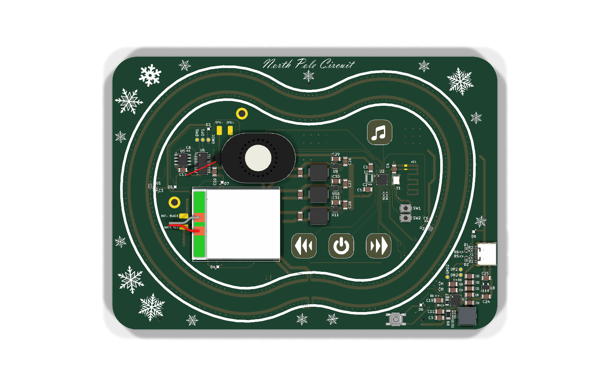

# North Pole BLE Audio Card

This is a work-in-progress derivative of the original
[Janky Jingle Crew NorthPoleCircuit](https://github.com/Janky-Jingle-Crew/NorthPoleCircuit).

The goal is to turn the original moving magnetic Christmas PCB card into a BLE-enabled audio postcard / mini-diorama with rechargeable battery power, real audio playback, capacitive touch controls, Hall checkpoints, and addressable RGB lighting.



## Status

Current state: hardware revision in progress.

- KiCad 10 PCB project is included under `PCB/`.
- Draft JLCPCB manufacturing files are included under `PCB/production/`.
- Firmware for this BLE/audio revision has not been written yet.
- The board has not yet been validated on real hardware.
- The audio playback IC sourcing is still a risk and should be checked before ordering.

Do not treat the current production files as a proven release. Review ERC/DRC, BOM sourcing, assembly rotations, antenna keepout, LiPo safety, and audio availability before manufacturing.

## Repository Layout

```text
PCB/                     KiCad 10 hardware project and draft manufacturing files
Firmware/                Placeholder for the new CH592X BLE/audio firmware
Code/                    Original upstream firmware, kept for reference only
CAD/                     Original upstream mechanical assets
Media/                   Original media plus new PCB renders
CHANGES_FROM_ORIGINAL.md Summary of the redesign
```

## Hardware Overview

This redesign keeps the magnetic track idea from the original project, but changes most of the control electronics.

Main blocks in the current KiCad design:

- CH592X BLE MCU
- 3 x DRV8837 H-bridge motor drivers
- WT2003H4-24SS audio playback IC
- PY25Q64HA SPI NOR flash for audio assets
- IP5209 1S LiPo charge / boost PMIC
- ME6211 3.3 V regulator
- 2 x DRV5032 Hall sensors
- 4 capacitive touch buttons
- 6 x 1010 addressable RGB LEDs, currently JLCPCB `C41347988`
- USB-C input
- 32 MHz crystal
- WCH-style PCB BLE antenna footprint
- thin speaker and 1S LiPo battery placement helpers

## Opening The PCB

Use KiCad 10.

Open:

```text
PCB/NorthPoleCircuit_PCB.kicad_pro
```

The local custom libraries are kept in the repo:

- `PCB/cust_sym.kicad_sym`
- `PCB/cust_fp/`
- `PCB/footprints.pretty/`

## Manufacturing Files

Draft manufacturing outputs are in:

```text
PCB/production/
```

Included files:

- `NorthPoleCircuit_PCB14.zip` - Gerber/drill archive
- `bom.csv` - JLCPCB BOM
- `positions.csv` - JLCPCB pick-and-place
- `designators.csv` - Fabrication Toolkit designator output

Before ordering, re-export these from KiCad/Fabrication Toolkit and compare against the files here.

## Firmware

Firmware for this revision is planned but not started. The intended bring-up order is documented in [Firmware/README.md](./Firmware/README.md).

The existing `Code/` directory is from the original upstream NorthPoleCircuit project and is not firmware for the CH592X BLE/audio redesign.

## Major Changes

See [CHANGES_FROM_ORIGINAL.md](./CHANGES_FROM_ORIGINAL.md).

Short version:

- single BLE-capable CH592X control architecture
- rechargeable LiPo power path
- audio playback IC and speaker path
- capacitive touch buttons
- Hall checkpoint sensing
- addressable RGB LEDs
- revised KiCad 10 PCB with custom artwork and JLCPCB metadata

## Attribution

Original project:

- [Janky Jingle Crew - NorthPoleCircuit](https://github.com/Janky-Jingle-Crew/NorthPoleCircuit)

Related inspiration:

- [Jeff McBride - Gauss Speedway](https://jeffmcbride.net/gauss-speedway/)

This repository is a derivative redesign. The original concept, mechanical idea, and much of the visual/magnetic-track inspiration belong to the original authors.

## License

TODO.

Before publishing a release or manufacturing publicly, verify the license/permission status of the upstream NorthPoleCircuit project. If the upstream project has no explicit open-source license, only the new original work in this redesign can be licensed without additional permission.
